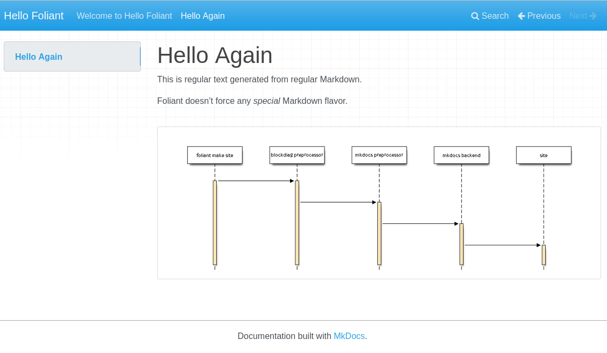
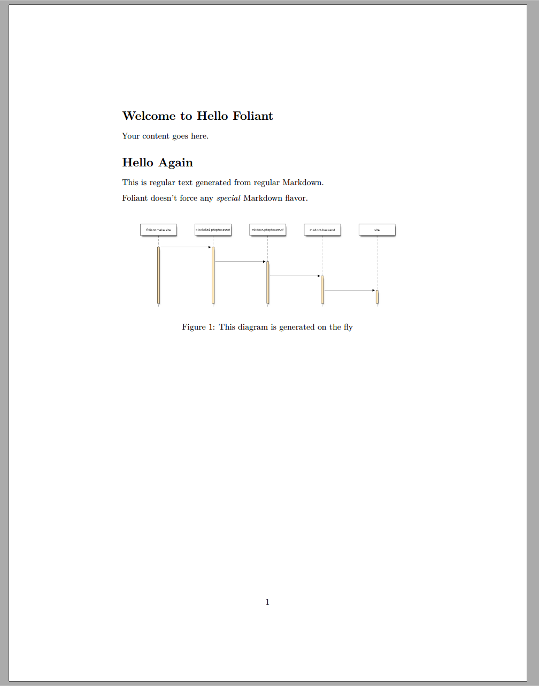
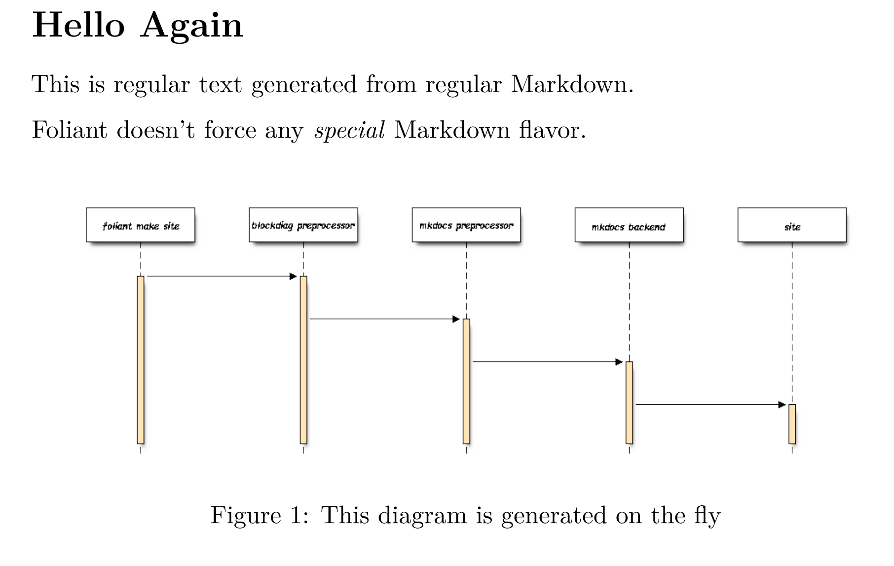

# Quickstart

In this tutorial, you’ll learn how to use Foliant to build websites and pdf documents from a single Markdown source. You’ll also learn how to use Foliant preprocessors.


## Create New Project

All Foliant projects must adhere to a certain structure. Luckily, you don’t have to memorize it thanks to <link src="cli/init/index.md" title="Init">Init</link> extension.

You should have installed it during <link src="installation.md" title="Installation">Foliant installation</link>) and it’s included in Foliant’s default Docker image.

To use it, run `foliant init` command:

```bash
$ foliant init
Enter the project name: Hello Foliant
✔ Generating Foliant project
─────────────────────
Project "Hello Foliant" created in hello-foliant
```

To do the same with Docker, run:

```bash
$ docker run --rm -it -v `pwd`:/usr/src/app -w /usr/src/app foliant/foliant init
Enter the project name: Hello Foliant
Generating project... Done
─────────────────────
Project "Hello Foliant" created in hello-foliant
```

Here’s what this command created:

```bash
$ cd hello-foliant
$ tree
.
├── docker-compose.yml
├── Dockerfile
├── foliant.yml
├── README.md
├── requirements.txt
└── src
    └── index.md

1 directory, 6 files
```

`foliant.yml` is your project’s config file.

`src` directory is where the content of the project lives. Currently, there’s just one file `index.md`.

`requirements.txt` lists  the Python packages required for the project: Foliant backends and preprocessors, MkDocs themes, and what not. The the Docker image for the project is built, these requirements are installed in it.

`Dockerfile` and `docker-compose.yml` are necessary to build the project in a Docker container.


## Build Site

To build a site you will first need a suitable backend (to catch up with the terminology, check <link src="architecture.md" title="Architecture And Basic Design Concepts">this article</link>. Let’s start with **MkDocs** backend. First, install it using the following command (or skip to the docker example):

```bash
python3 -m pip install foliantcontrib.mkdocs
```

Then, in the project directory, run:

```bash
$ foliant make site
Parsing config... Done
Applying preprocessor mkdocs... Done
Applying preprocessor _unescape... Done
Making site with MkDocs... Done
────────────────────
Result: Hello_Foliant-2020-05-25.mkdocs
```

Or, with Docker Compose:

```bash
$ docker-compose run --rm foliant make site
Parsing config... Done
Applying preprocessor mkdocs... Done
Applying preprocessor _unescape... Done
Making site with MkDocs... Done
────────────────────
Result: Hello_Foliant-2020-05-25.mkdocs
```

That’s it! Your static, MkDocs-powered website is ready. To look at it, use any web server, for example, Python’s built-in one:

```bash
$ python3 -m http.server -d Hello_Foliant-2020-05-25.mkdocs
Serving HTTP on 0.0.0.0 port 8000 (http://0.0.0.0:8000/) ...
```

Open [localhost:8000](http://localhost:8000/) in your web browser. You should see something like this:


## Build PDF

>   **Note**
>
>   To build PDF with Pandoc, make sure you have it and TeXLive installed (see <link src="installation.md" title="Installation">Installation</link>).

In the project directory, run:

```bash
$ foliant make pdf
Parsing config... Done
Applying preprocessor flatten... Done
Applying preprocessor _unescape... Done
Making pdf with Pandoc... Done
────────────────────
Result: Hello_Foliant-2020-05-25.pdf
```

To build pdf in Docker container, first uncomment `foliant/foliant:pandoc` in your project’s `Dockerfile`:

```diff
- FROM foliant/foliant
+ # FROM foliant/foliant
# If you plan to bake PDFs, uncomment this line and comment the line above:
- # FROM foliant/foliant:pandoc
+ FROM foliant/foliant:pandoc

COPY requirements.txt .

RUN pip3 install -r requirements.txt
```

>   **Note**
>
>   Run `docker-compose build` to rebuild the image from the new base image if you have previously run `docker-compose run` with the old one. Also, run it whenever you need to update the versions of the required packages from `requirements.txt`.

Then, run this command in the project directory:

```bash
$ docker-compose run --rm foliant make pdf
Parsing config... Done
Applying preprocessor flatten... Done
Applying preprocessor _unescape... Done
Making pdf with Pandoc... Done
────────────────────
Result: Hello_Foliant-2020-05-25.pdf
```

Your standalone pdf documentation is ready! It should look something like this:


## Edit Content

Your project’s content lives in `*.md` files in `src` folder. You can split it between multiple files and subfolders.

Foliant encourages [pure Markdown](https://daringfireball.net/projects/markdown/) syntax as described by John Gruber. Pandoc, MkDocs, and other backend-specific additions are allowed, but we strongly recommend to put them in <link src="preprocessors/flags.md" title="Flags">`<if>...</if>`</link>.

Create a file `hello.md` in `src` with the following content:

```markdown
# Hello Again

This is regular text generated from regular Markdown.

Foliant doesn’t force any *special* Markdown flavor.
```

Open `foliant.yml` and add `hello.md` to `chapters`:

```
title: Hello Foliant

chapters:
  - index.md
  - hello.md
```

Rebuild the project to see the new page:

```bash
$ docker-compose run --rm foliant make site && docker-compose run --rm foliant make pdf
Parsing config... Done
Applying preprocessor mkdocs... Done
Applying preprocessor _unescape... Done
Making site with MkDocs... Done
────────────────────
Result: Hello_Foliant-2020-05-25.mkdocs
Parsing config... Done
Applying preprocessor flatten... Done
Applying preprocessor _unescape... Done
Making pdf with Pandoc... Done
────────────────────
Result: Hello_Foliant-2020-05-25.pdf
```

And see the new page appear on the site and in the pdf document:


## Use Preprocessors

Preprocessors is what makes Foliant special and extremely flexible. Preprocessors are additional packages that, well, preprocess the source code of your project. You can do all kinds of stuff with preprocessors:

-   include remote Markdown files or their parts in the source files,
-   render diagrams from textual description on build,
-   restructure the project source or compile it into a single file for a particular backend.

In fact, you have already used two preprocessors! Check the output of the `foliant make` commands and note the lines `Applying preprocessor mkdocs` and `Applying preprocessor flatten`. The first one informs you that the project source has been preprocessed with `mkdocs` preprocessor in order to make it compatible with MkDocs’ requirements, and the second one tells you that <link src="preprocessors/flatten.md" title="Flatten">`flatten`</link> preprocessor was used to squash the project source into one a single file (because Pandoc only works with single files).

These preprocessors were called by MkDocs and Pandoc backends respectively. You didn’t have to install or activate them explicitly.

Now, let’s try to use a different kind of preprocessors, the ones that register new tags: <link src="preprocessors/blockdiag.md" title="Blockdiag">Blockdiag</link>.

### Embed Diagrams with Blockdiag

[Blockdiag](http://blockdiag.com/) is a Python app for generating diagrams. Blockdiag preprocessor extracts diagram descriptions from the project source and replaces them with the generated images.

First, we need to install the blockdiag preprocessor:

```bash
$ python3 -m pip install foliantcontrib.blockdiag
```
Or, if you are building with docker, add `foliantcontrib.blockdiag` to requirements.txt and rebuild the image with `docker-compose build` command.

Next, we need to switch on the <link src="preprocessors/blockdiag.md" title="Blockdiag">`blockdiag`</link> preprocessor in config. Open `foliant.yml` and add the following lines:

```diff
title: Hello Foliant
+
+ preprocessors:
+  - blockdiag

chapters:
  - index.md
  - hello.md

```

Then, in `hello.md`, add the following:

```diff
Foliant doesn’t force any *special* Markdown flavor.

+ <seqdiag caption="This diagram is generated on the fly">
+   seqdiag {
+     "foliant make site" -> "mkdocs preprocessor" -> "blockdiag preprocessor" -> "mkdocs backend" -> site;
+   }
+ </seqdiag>
```

Blockdiag preprocessor adds several tags to Foliant, each corresponding to a certain diagram type. Sequence diagrams are defined with `<seqdiag></seqdiag>` tag. This is what we used in the sample above. The diagram definition sits in the tag body and the diagram properties such as caption or format are defined as tag parameters.

Rebuild the site with `foliant make site` and open it in the browser:



Rebuild the pdf as well and see that the diagram is there too:



Let’s customize the look of the diagrams in our project by setting their properties in the config file. For example, let’s use a custom font for labels. I’m using the ever popular Comic Sans font, but you can pick any font that’s available in `.ttf` format.

Put the font file in the project directory and add the following lines to `foliant.yml`:

```diff
preprocessors:
-   - blockdiag
+   - blockdiag:
+       params:
+           font: !path comic.ttf
```

After a rebuild, the diagram on the site and in the pdf should look like this:




There are many more params you can define for your diagrams. You can override global params for particluar diagrams in their tags. And by combining this preprocessor with <link src="preprocessors/flags.md" title="Flags">Flags</link> you can even set different params for different backends, for example build vector diagrams for pdf output and bitmap for site:

```markdown
This is a diagram that is rendered to `.png` in HTML and to `.pdf` in pdf:

<blockdiag format="<if targets="site">png</if><if targets="pdf">pdf</if>">
    ...
</blockdiag>
```

The possibilities acquired by combining different preprocessors are endless!

> **Why Foliant Uses XML syntax for Preprocessor Tags**
>
> It’s common for Markdown-based tools to extend Markdown with custom syntax for additional functions. There’s no standard for custom syntax in the Markdown spec, so every developer uses whatever syntax is available for them, different one for every new extension.
>
> In Foliant, we tried our best not to dive into this mess. Foliant aims to be an extensible platform, with many available preprocessors. So we needed one syntax for all preprocessors, but the one that was flexible enough to support them all.
>
> After trying many options, we settled with XML. Yes, normally you’d have a nervous tick when you hear XML, and so would we, but this is one rare case where XML syntax belongs just right:

> -   it allows to provide tag body and named parameters,
> -   it’s familiar to every techwriter out there,
> -   it’s close enough to HTML, and HTML tags are actually allowed by the Markdown spec, so we’re not even breaking the vanilla Markdown spec (almost),
> -   it’s nicely highlighted in IDEs and text editors.
