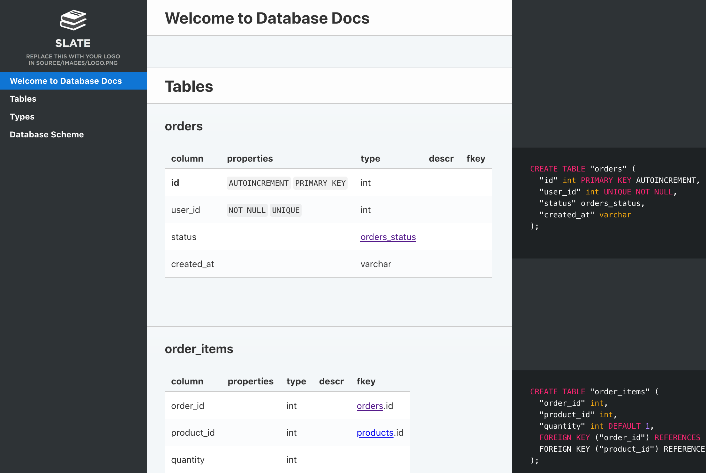

# Documenting DBML schema

Quote from the official website: *[DBML](https://dbml.org) (Database Markup Language) is an open-source DSL language designed to define and document database schemas and structures. It is designed to be simple, consistent and highly-readable.* And that makes it a perfect choice for designing your database. You can create your table structure without messing with cumbersome SQL in a more human-readible way like this:

```
Table users {
  id integer
  username varchar
  role varchar
  created_at timestamp
}

Table posts {
  id integer [primary key]
  title varchar
  body text [note: 'Content of the post']
  user_id integer
  status post_status
  created_at timestamp
}

Enum post_status {
  draft
  published
  private [note: 'visible via URL only']
}

Ref: posts.user_id > users.id // many-to-one
```

As you may have noticed, DBML also has tools to document pieces of you schema using *notes* (`body text [note: 'Content of the post']`) and comments (`Ref: posts.user_id > users.id // many-to-one`).

So how can we convert DBML schema descriptions into a human-readible document? The idea is pretty simple: we parse the DBML definitions and pass them to a Jinja template, which renders markdown for us. After that we use one of our backends (we will use [Slate](https://foliant-docs.github.io/docs/backends/slate/) in this tutorial) to build a static site out of it.

We won't need to do it all manually, of course, we just need to configure Foliant to do that for us.

## Installing prerequisites

If you are running Foliant natively, you will need to install some prerequisites. But if you are working with our [Full Foliant Docker image](../full_docker.md), you don't need to do that, just go to the next stage.

First, you will need Foliant, of course. If you don't have it yet, please, refer to the [installation guide](https://foliant-docs.github.io/docs/installation/).

Next, let's install [Foliant Init](https://github.com/foliant-docs/foliantcontrib.init/) to facilitate the task of creating new project:

```bash
$ pip3 install foliantcontrib.init
```

Install DBMLDoc and PlantUML preprocessors, and the Slate backend:

```bash
$ pip3 install foliantcontrib.dbmldoc foliantcontrib.slate, foliantcontrib.plantuml
```

We are going to use [Slate](https://github.com/slatedocs/slate) for building a static website with documentation, so you will need to [install Slate dependencies](https://github.com/slatedocs/slate/wiki/Using-Slate-Natively).

Finally, [install PlantUML](https://plantuml.com/ru/starting), we will need it to draw database scheme.

## Creating project

Let's create a Foliant project for our experiments. `cd` into the directory where you want your project created and run the `init` command:

```bash
$ cd ~/foliant_projects
$ foliant init
Enter the project name: Database Docs
Generating project... Done
────────────────────
Project "Database Docs" created in database-docs

$ cd database-docs
```

The other option is to clone the [Foliant Project template](https://github.com/foliant-docs/foliant_project_template) repository:

```bash
$ cd ~/foliant_projects
$ mkdir database-docs
$ git clone https://github.com/foliant-docs/foliant_project_template.git database-docs
Cloning into 'database-docs'...
remote: Enumerating objects: 11, done.
remote: Counting objects: 100% (11/11), done.
remote: Compressing objects: 100% (7/7), done.
remote: Total 11 (delta 1), reused 11 (delta 1), pack-reused 0
Unpacking objects: 100% (11/11), done.
$ cd database-docs
```

Next, let's download the sample DBML spec and save it into file `schema.dbml` in the root your Foliant project:

```bash
$ wget https://raw.githubusercontent.com/holistics/dbml/master/packages/dbml-core/__tests__/parser/dbml-parse/input/general_schema.in.dbml -O schema.dbml
```

## Setting up project

Now it's time to set up our config. Open `foliant.yml` and add the following lines:

```diff
title: Database Docs

chapters:
  - index.md

+preprocessors:
+  - dbmldoc:
+      spec_path: schema.dbml
+  - plantuml
+
```

We've added the PlantUML and DBMLDoc preprocessors to the pipeline and specified path to our DBML sample schema. DBMLDoc will parse our schema and convert it into Markdown, plantuml will draw the visual diagram of our DB schema.

> Note: if plantuml is not available under `$ plantuml` in your system, you will also need to specify path to platnum.jar in preprocessor settings like this:
> ```yaml
>   - plantuml:
>       plantuml_path: /usr/bin/plantuml.jar
> ```

Finally, we need to tell Foliant where in the source files should it insert the generated documentation. Since we already have an `index.md` chapter created for us by `init` command, let's put it in there. Open `src/index.md` and make it look like this:

```diff
# Welcome to Database Docs

-Your content goes here.
+<dbmldoc></dbmldoc>
+
```

## Building site

All preparations done, let's build our site:

```
$ foliant make site -w slate
Parsing config... Done
Applying preprocessor dbmldoc... Done
Applying preprocessor plantuml... Done
Applying preprocessor flatten... Done
Applying preprocessor _unescape... Done
Making site... Done
...
────────────────────
Result: Database_Docs-2020-06-03.slate/
```

If you are using Docker, the command is:

```
$ docker-compose run --rm foliant make site -w slate
```

Now open `Database_Docs-2020-06-03.slate/index.html` and look what you've got:



That looks good enough, but you may want to tweak the appearance of your site. You can edit the Jinja-template to change the way DBMLDoc generates markdown our of your schema. After first build, the default template should have appeared in your project dir under the name `dbml.j2`. If you want to change the looks of you site, please, refer for instructions to the [Slate](https://foliant-docs.github.io/docs/backends/slate/) backend documentation.
