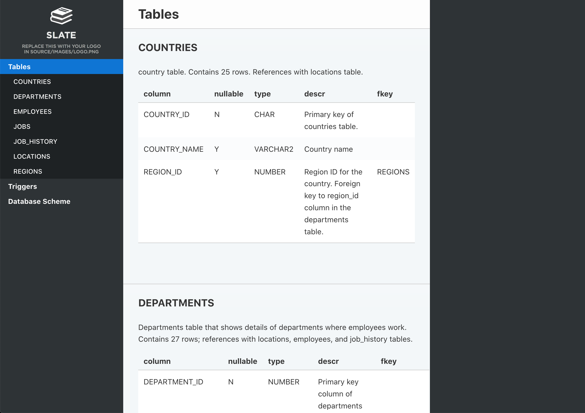

# Documenting Oracle Database

> Please note that in this article we cover only the basic usage of the tools. For detailed information on features and customizing output refer to each component’s doc page.


## Installing prerequisites

First you will need to install some prerequisites. If you are running Foliant natively, follow the guide below. If you are working with our <link src="../full_docker.md" title="Working with Full Foliant Docker image">Full Docker image</link>, you don’t need to do anything just now, you can skip to the next stage.

First, you will need Foliant, of course. If you don’t have it yet, please, refer to the <link src="../../installation.md" title="Installation">installation guide</link>.

Next, let’s install <link src="../../cli/init/index.md" title="Init">Foliant Init</link> to facilitate the task of creating new project:

```bash
$ pip3 install foliantcontrib.init
```

Install DBDoc and PlantUML preprocessors, and the Slate backend:

```bash
$ pip3 install foliantcontrib.dbdoc foliantcontrib.slate, foliantcontrib.plantuml
```

We are going to use <link src="../../backends/slate.md" title="Slate">Slate</link> for building a static website with documentation, so you will need to [install Slate dependencies](https://github.com/slatedocs/slate/wiki/Using-Slate-Natively).

[Install PlantUML](https://plantuml.com/ru/starting), we will need it to draw the database scheme.

Install [Oracle Instant Client](https://www.oracle.com/database/technologies/instant-client.html), if you don’t have it. We will needed it to query the database.

## Creating project

Let’s create a Foliant project for our experiments. `cd` to the directory where you want your project created and run the `init` command:

```bash
$ cd ~/foliant_projects
$ foliant init
Enter the project name: Database Docs
Generating project... Done
────────────────────
Project "Database Docs" created in database-docs

$ cd database-docs
```

The other option is to clone the [Foliant Project template](https://github.com/foliant-docs/foliant_project_template/) repository:

```bash
$ cd ~/foliant_projects
$ mkdir database-docs
$ git clone https://github.com/foliant-docs/foliant_project_template.git database-docs
Cloning into 'database-docs'...
remote: Enumerating objects: 11, done.
remote: Counting objects: 100% (11/11), done.
remote: Compressing objects: 100% (7/7), done.
remote: Total 11 (delta 1), reused 11 (delta 1), pack-reused 0
Unpacking objects: 100% (11/11), done.
$ cd database-docs
```

## Setting up project

Now it’s time to set up our config. Open `foliant.yml` and add the following lines:

```diff
title: Database Docs

chapters:
  - index.md

+preprocessors:
+   - dbdoc:
+       host: localhost
+       port: 1521
+       dbname: orcl
+       user: hr
+       password: oracle
+  - plantuml
+
```

Make sure to use proper credentials for your Oracle database. If you are running Foliant from docker, you can use `host: host.docker.internal` to access `localhost` from docker.

> Note: if plantuml is not available under `$ plantuml` in your system, you will also need to specify path to platnum.jar in preprocessor settings like this:

```yaml
  - plantuml:
      plantuml_path: /usr/bin/plantuml.jar
```

Finally, we need to tell Foliant where in the source files should it insert the generated documentation. Since we already have an `index.md` chapter created for us by `init` command, let’s put it in there. Open `src/index.md` and make it look like this:

```diff
# Welcome to Database Docs

-Your content goes here.
+<dbdoc></dbdoc>
+
```

If you are using Docker, you will also need to add Oracle Instant Client to your image. Since it is a proprietary software, we cannot include it in our Full Docker Image. But you can do it yourself. Our image is based on Ubuntu, so you can find instructions on how to install Oracle Instant Client on Ubuntu (spoiler: it’s not that easy) and add those commands into the Dockerfile, or just find those commands made by someone else. For example, from this [Dockerfile by Sergey Makinen](https://github.com/sergeymakinen/docker-oracle-instant-client/blob/master/12.2/Dockerfile). Copy all commands starting from the third line into your `Dockerfile` and run `docker-compose build` to rebuild the image.

## Building site

All preparations done, let’s build our site:

```
$ foliant make site -w slate
Parsing config... Done
Applying preprocessor dbdoc... Done
Applying preprocessor plantuml... Done
Applying preprocessor flatten... Done
Applying preprocessor _unescape... Done
Making site... Done
...
────────────────────
Result: Database_Docs-2020-06-03.slate/
```

If you are using Docker, the command is:

```
$ docker-compose run --rm foliant make site -w slate
```

Now open `Database_Docs-2020-06-03.slate/index.html` and look what you’ve got:



That looks good enough, but you may want to tweak the appearance of your site. You can edit the Jinja-template to change the way DBMLDoc generates markdown our of your schema. The default template can be found [here](https://github.com/foliant-docs/foliantcontrib.dbdoc/blob/master/foliant/preprocessors/dbdoc/oracle/templates/doc.j2). Edit it and save in your project dir, then specify in the `doc_template` parameter. If you want to change the looks of you site, please, refer for instructions to the <link src="../../backends/slate.md" title="Slate">Slate</link> backend documentation.
