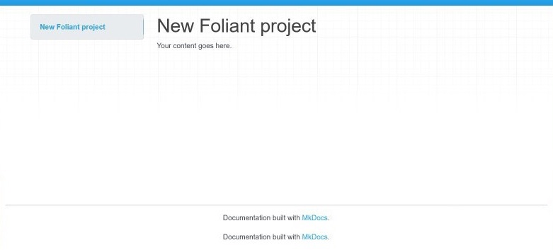

# Working with Full Foliant Docker image

In this tutorial, we will go through the steps of working with Foliant using the Full Docker image. This is the recommended way of working with Foliant, and here’s why.

Internally Foliant is not an independent documentation builder, which does everything itself, but rather an orchestrator of different tools. Foliant configures and runs them under the hood as a part of its pipeline, saving you the need to run them yourself. Of course, that’s not all Foliant does, it has a lot to offer in terms of text processing itself, but many preprocessors and almost all backends use external tools in one way or another.

That was our goal from the beginning: why build your own static site generator if there are already such beautiful libraries like MkDocs or Slate? Why spend a year on creating your own Markdown to PDF generator if Pandoc has already perfected this craft? And if you are not satisfied with Pandoc, you can plug into Foliant something else, like MdToPdf. This approach comes with some disadvantages though. Let me illustrate that with an example.

One of the popular ways to use Foliant is to build a static site with <link src="api.md" title="Documenting API with Foliant">API documetnation</link>. After making all necessary configuration you just run the command:

```bash
$ foliant make site -w slate
```

...and get a folder with a generated static site.

While the command is pretty simple, internally Foliant will do the following:

1. Download your `swagger.yaml` specification file over the link you supplied in config.
2. Pass `swagger.yaml` to the [Widdershins](https://github.com/Mermade/widdershins/) tool which will convert it to Markdown.
3. Run some other specified preprocessors which may call [PlantUML](https://plantuml.com/) for generating diagrams or replace links to Jira issues with badges from [Shields.io](https://shields.io/), etc.
4. Glue all your separate md-source files into one with <link src="../preprocessors/flatten.md" title="Flatten">Flatten</link> preprocessor.
5. Call [Slate](https://github.com/slatedocs/slate/) static site generator to build your site.

In this just one use case, Foliant had to internally run several third-party apps, each one of which needs to be installed on your computer before running the `foliant make site` command. It involves:

- Installing Widdershins, which is written on JS, so it will require [npm](https://www.npmjs.com/) and [Node.js](https://nodejs.org/en/) to be installed preliminarily.
- Installing PlantUML which requires [Java](https://www.java.com/ru/) and [Graphviz](https://graphviz.org/) installed preliminarily.
- Installing Slate, which requires [Ruby](https://www.ruby-lang.org/), [Bundler](https://bundler.io/), and a bunch of other dependencies.

Woah! That’s a lot of prerequisites! Now imagine you don’t have any of them and you will have to spend half a day installing them and making sure they work. And now imagine that you want to build that static site on your home computer and you will need to waste another half a day just to do all that again.

That’s where [Docker](https://www.docker.com/) steps in.

## How can Docker make your life easier

Docker allows you to run specific commands in an isolated, preconfigured environment, with no dependence on the system it is running on.

After reading the previous section, you now may have just one dream: how great would it be if I never needed to configure and install anything, and it would just work out of the box.

That was exactly our dream when Foliant started growing, so we’ve come up with a **Full Foliant Docker Image**, which has all the dependencies pre-installed. Not just backends and preprocessors, but all the open-source tools, which are used by them (except some proprietary tools like Oracle instant client).

It has [Pandoc](https://pandoc.org/) with [TexLive](https://tug.org/texlive/) for building beautiful and most complex PDFs, it has the most recent [Slate](https://github.com/slatedocs/slate/) static site generator with all the headache of installing Ruby dependencies already solved for you, it even has a [PostgreSQL](https://www.postgresql.org/) client if you ever need to generate docs for your database.

We keep the image up to date, and all new features that Foliant gets, shortly appear in there, so the only thing you should worry about is updating this image from time to time.

But there is a disk space issue. You see, since we’ve included almost everything you will ever need to use full Foliant’s potential, the image had grown up to 2.5GB in compressed size and 6.5GB in unpacked form. That’s mostly due to the TexLive package and some other bulky dependencies. All that will require decent Internet Bandwidth and some free disk space to download, which should not be that big of an issue in the modern world. If you prefer more compact installations, please, refer to the <link src="../quickstart.md" title="Quickstart">Quickstart</link> where we show how to work with slimmer Foliant images.

But enough introductions, let’s make it work!

# Getting Docker

The first step is to download and install Docker.

**Windows**

Go to [https://www.docker.com/get-started](https://www.docker.com/get-started) and download Docker installer.

Follow the instructions of the installer. In the end, it may ask you to restart the computer. After restarting, run Docker by the shortcut in your Start menu.

**Linux**

Please, follow the [instructions](https://docs.docker.com/engine/install/) for your Linux distribution on the official docs.

After that [install Docker Compose](https://docs.docker.com/compose/install/#install-compose-on-linux-systems).

**MacOs**

Download and install Docker from [this page](https://hub.docker.com/editions/community/docker-ce-desktop-mac/).

## Setting up Foliant project

Now that we’ve got Docker, we can create our test project.

Clone somewhere on your machine the [Foliant Project template](https://github.com/foliant-docs/foliant_project_template). It’s an empty Foliant project with the required file and directory structure. It also includes necessary Docker configs.

Open your terminal and `cd` to the directory with the cloned project template. You should see the following directory structure

```bash
$ tree
.
├── Dockerfile
├── README.md
├── docker-compose.yml
├── foliant.yml
└── src
    └── index.md
```

Now let’s build the Docker image:

```bash
$ docker-compose build
Building foliant
Step 1/1 : FROM foliant/foliant:full
full: Pulling from foliant/foliant
eeacba527962: Pull complete
25405ed4f245: Pull complete
...
7ac153b46dbe: Pull complete
Digest: sha256:0adac7993bb4f8178f62fc9bc1e8aa51a541629773a0f049b39949024e3b9353
Status: Downloaded newer image for foliant/foliant:full
 ---> 51f465b95411load complete
Successfully built 51f465b95411
Successfully tagged test_foliant:latest
```

> You will need to run this command every time after updating the image or editing `Dockerfile`. But you don’t need to run it again if you edited any Foliant-related files, including source Markdown files or `foliant.yml`.

All preparations are done! Now let’s build a site with MkDocs to test it out.

```bash
docker-compose run --rm foliant make site -w mkdocs
Creating network "test_default" with the default driver
Parsing config... Done
Applying preprocessor mkdocs... Done
Applying preprocessor _unescape... Done
Making site with MkDocs... Done
────────────────────
Result: New_Foliant_Project-2020-06-04.mkdocs
```

> We used the `-w` option to tell Foliant that we want MkDocs backend to build our site. Full Foliant image contains many different backends, and several of them are capable of building `site` target. Without `-w` option Foliant will just ask you which backend to use.

Now open `index.html` inside the newly created `New_Foliant_Project-2020-06-04.mkdocs` folder, you should see something like this:



That means, it worked. Now you have all power of Foliant at your disposal!

One last thing: we keep developing Foliant and release new versions of different preprocessors almost every week, so make sure to update the Docker image every once in a while. To do this, run the command:

```bash
$ docker pull foliant/foliant:full
```
